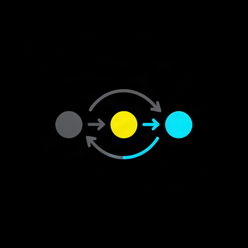
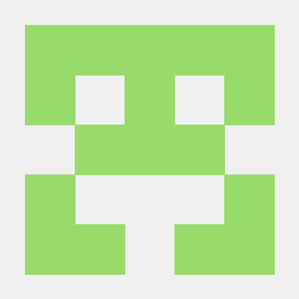
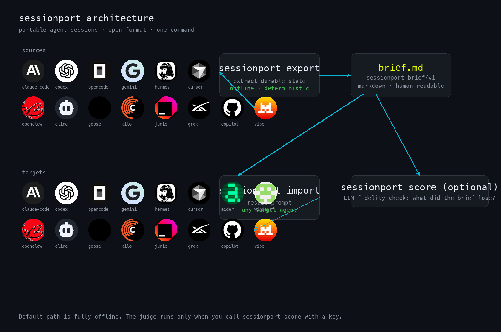

<p align="center">
  
</p>

<h1 align="center">sessionport</h1>

<p align="center">
  <b>Carry your AI agent sessions between CLIs.</b><br>
  Export any session to one portable, human-readable brief. Resume it in any other agent.
</p>

<p align="center">
  <a href="https://github.com/Reality-Shifting-Tech/sessionport/actions"></a>
  <a href="https://pypi.org/project/sessionport/"></a>
  <a href="LICENSE"></a>
</p>

<p align="center">
  
</p>

---

## Why

You work in Claude Code today and OpenCode tomorrow. Codex for the weekend, Cursor for the one-off fix. Every agent has its own session store, its own format, and zero memory of the others. Switch agents and your context dies: the decisions, the constraints, the files you already read, the next steps you agreed on.

sessionport is the missing layer. It reads any agent's local session store, distills the durable parts into one markdown brief, and hands that brief to any other agent as a resume prompt.

- **Offline by default.** Export never calls the network. Your sessions stay on your machine.
- **Open format.** A brief is markdown with plain frontmatter: read it, diff it, commit it.
- **One command.** `sessionport export` out of one agent, `sessionport import` into the next.

## Supported agents

| | Agent | Store |
|---|---|---|
|  | **Claude Code** | JSONL transcripts (`~/.claude/projects`) |
|  | **Codex** | JSONL sessions (`~/.codex/sessions`) |
|  | **OpenCode** | JSON session files |
|  | **Gemini CLI** | Markdown transcripts |
|  | **Hermes** | SQLite session databases |
|  | **Cursor** | JSONL agent sessions (`~/.cursor/agent`) |
|  | **Aider** | Markdown history (`~/.aider.chat/history`) |
|  | **Windsurf** | JSONL sessions (`~/.windsurf`) |
|  | **OpenClaw** | JSONL sessions (`~/.openclaw`) |
|  | **Cline** | JSONL tasks (`~/.config/cline/tasks`) |
|  | **Goose** (Block) | JSONL sessions (`~/.goose`) |
|  | **Kilo** (Cerebras) | JSONL sessions (`~/.kilo`) |
|  | **Junie** (JetBrains) | JSONL sessions (`~/.junie`) |
|  | **Grok Code** (xAI) | JSONL sessions (`~/.grok`) |
|  | **Copilot CLI** (GitHub) | JSONL sessions (`~/.copilot-cli`) |
|  | **Vibe** (Mistral) | JSONL sessions (`~/.vibe`) |

Every store location can be overridden with a `SESSIONPORT_*` environment
variable for CI and unusual setups (`SESSIONPORT_CLAUDE_HOME`,
`SESSIONPORT_CODEX_HOME`, `SESSIONPORT_GEMINI_HOME`, `SESSIONPORT_OPENCODE_HOME`,
`SESSIONPORT_HERMES_DB`, `SESSIONPORT_CURSOR_HOME`, `SESSIONPORT_AIDER_HOME`,
`SESSIONPORT_WINDSURF_HOME`, `SESSIONPORT_OPENCLAW_HOME`, `SESSIONPORT_CLINE_HOME`,
`SESSIONPORT_GOOSE_HOME`, `SESSIONPORT_KILO_HOME`, `SESSIONPORT_JUNIE_HOME`,
`SESSIONPORT_GROK_HOME`, `SESSIONPORT_COPILOT_HOME`, `SESSIONPORT_VIBE_HOME`).

## Install

```bash
pip install sessionport
# MCP server support:
pip install 'sessionport[mcp]'
# or
uv tool install sessionport
# or Homebrew
brew tap reality-shifting-tech/sessionport
brew install sessionport
```

Requires Python >= 3.11. macOS, Linux, and Windows.

## Quickstart

```bash
# see every session, from every agent, in one place
sessionport list

# turn a session into a portable brief
sessionport export claude-code:9f9f9f9f

# export every session you have
sessionport export --all --out-dir briefs/

# hand the brief to another agent as a resume prompt
sessionport import brief-claude-code-9f9f9f9f.md --into codex --copy

# did the brief lose anything? (optional, needs an LLM key)
sessionport score brief-claude-code-9f9f9f9f.md --source claude-code:9f9f9f9f

# same loop over MCP for any agent client (needs sessionport[mcp])
sessionport mcp
```

That's the whole loop: export, carry, import, resume.

## How it works

<p align="center">
  
</p>

1. **Discover.** `sessionport list` walks each agent's local session store.
2. **Extract.** `sessionport export` reads the transcript and pulls out the durable
   parts: goal, decisions, files touched, URLs, code blocks, next actions,
   constraints, key facts. Deterministic heuristics, no LLM, no network.
3. **Carry.** The result is one `sessionport-brief/v1` markdown file.
4. **Resume.** `sessionport import` wraps the brief in a resume prompt for any
   target agent. Paste it, or `--copy` it, and the new agent continues the
   work without re-litigating settled decisions.

## The brief format

`sessionport-brief/v1` is markdown with flat YAML-flavored frontmatter. Example:

```markdown
---
format: sessionport-brief/v1
source-agent: claude-code
session: 9f9f9f9f-1111-2222-3333-444444444444
exported: 2026-08-06T00:41:29Z
messages: 4
estimated_tokens: 121
---

# Session brief (claude-code)

## Goal

Fix the auth bug in login.py: the session cookie is not being set on refresh

## Decisions

- Decision: switch to httpOnly secure cookies. We'll go with SameSite=Lax...

## State: files

- login.py
- tests/test_session.py

## Constraints

- Constraint: never store tokens in localStorage.
```

Human-readable, git-diffable, machine-parseable. The format is versioned in
the frontmatter so future revisions migrate explicitly.

## Fidelity scoring

A brief is only useful if it kept what mattered. `sessionport score` compares a
brief against its source transcript with an LLM judge and reports:

- **fidelity**: 0.0-1.0, how much of the session's durable knowledge survived
- **missed**: the specific facts the brief lost
- **notes**: one-sentence verdict

Opt-in and env-gated, against any OpenAI-compatible endpoint (Ollama works
too: point `SESSIONPORT_JUDGE_ENDPOINT` at `http://localhost:11434/v1`):

```bash
export SESSIONPORT_JUDGE_API_KEY=sk-...
export SESSIONPORT_JUDGE_ENDPOINT=https://api.openai.com/v1/chat/completions  # default
export SESSIONPORT_JUDGE_MODEL=gpt-4o-mini                                     # default
sessionport score brief.md --source claude-code:9f9f9f9f

# or override per call:
sessionport score brief.md --source claude-code:9f9f9f9f --endpoint http://localhost:11434/v1 --model llama3
```

The judge never runs on the export path, and transcripts are truncated to
120k characters.

## Fleet tooling

sessionport is also a fleet dashboard in one command, fully offline:

```bash
# where did I talk about X? every transcript, every agent
sessionport search "auth bug"

# what changed between two briefs? per-section, no LLM
sessionport diff brief-old.md brief-new.md

# how big is my fleet?
sessionport stats

# is my install working? which stores were found?
sessionport doctor
```

## MCP server

`sessionport mcp` exposes the same loop over MCP stdio for any MCP client
(Claude Desktop, Cursor, OpenCode, your own harness):

- `list_sessions(agent)` — discover sessions
- `export_brief(session)` — render a portable brief
- `import_prompt(brief_file, into)` — build a resume prompt

Install with `pip install 'sessionport[mcp]'`.

## CLI reference

```
sessionport list [--agent NAME] [--json]
sessionport export [SESSION] [--all] [--agent NAME] [--out FILE] [--out-dir DIR] [--json]
sessionport import FILE [--into AGENT] [--copy] [--out FILE]
sessionport score FILE --source AGENT:SESSION [--endpoint URL] [--model NAME] [--json]
sessionport search QUERY [--agent NAME] [--limit N] [--json]
sessionport diff OLD NEW [--json]
sessionport stats [--agent NAME] [--json]
sessionport doctor [--json]
sessionport mcp
sessionport version
```

`SESSION` is `agent:id` (e.g. `claude-code:9f9f9f9f`), or a bare id that is
searched across all stores. `--all` exports every discovered session into
`--out-dir` (default `briefs/`).

## Development

```bash
uv sync --extra dev
make all          # lint + typecheck + test (the full gate)
make images       # regenerate docs/images
```

54 passing tests, zero-warning lint, strict mypy. See [AGENTS.md](AGENTS.md) for the
operational reference and [CONTRIBUTING.md](CONTRIBUTING.md) for the
contribution contract.

## Roadmap

- Community adapter SDK and adapter registry
- Tokenized search index for very large fleets
- Brief diff tooling polish (`--stat` style summaries)
- Windows installer (winget)

## License

MIT. See [LICENSE](LICENSE). Third-party attributions in
[THIRD_PARTY_NOTICES.md](THIRD_PARTY_NOTICES.md).
